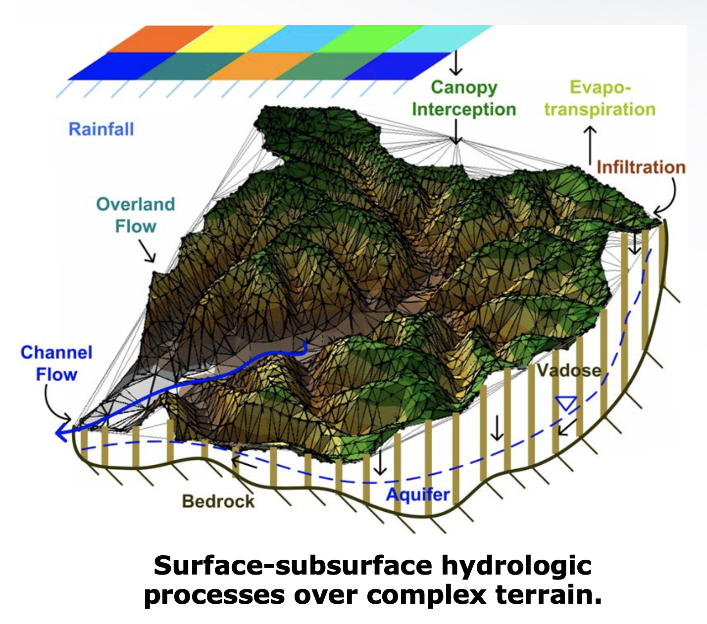

.. tRIBS Docs documentation master file, created by
   sphinx-quickstart on Thu Apr  9 15:33:28 2020.
   You can adapt this file completely to your liking, but it should at least
   contain the root `toctree` directive.

Welcome to tRIBS Documentation!
======================================

.. toctree::
   :maxdepth: 2
   :caption: Contents:

Indices and tables
==================

* :ref:`genindex`
* :ref:`modindex`
* :ref:`search`

Distributed Hydrologic Model *tRIBS*
=====================================

The **TIN-based Real-time Integrated Basin SImulator (tRIBS)**, is fully
distributed model of hydrologic processes.

What type of processes does tRIBS model?
_________________________________________

The *tRIBS* model description can be found in [Ivanov et al. 2004a]_, [Ivanov et al. 2004b]_
and [Vivoni et al. 2004]_.

We mention a few *tRIBS* processes it models:

- Couple the vadose and saturated zones with the dynamic water table.
- Moisture infiltration waves.
- Soil moisture redistribution.
- Topography-driven lateral fluxes in the vadose and groundtable zones.
- Computes the radiation and energy balance.
- Interception, evaporation and evpotrasnpiration.
- Hydrologic and hydraulic routing.
- other.

.. [Ivanov et al. 2004a] Ivanov, V.Y., Vivoni, E.R., Bras, R.L. and Entekhabi, D. 2004a. Catchment Hydrologic
   Response with a Fully-Distributed Triangulated Irregular Network Model. Water Resources Research. 40(11): W11102.

.. [Ivanov et al. 2004b] Ivanov, V.Y., Vivoni E.R., Bras, R.L. and Entekhabi, D. 2004b. Preserving high-resolution
   surface and rainfall data in operational-scale basin hydrology: A fully-distributed, physically-based
   approach. Journal of Hydrology. 298(1-4): 80-111

.. [Vivoni et al. 2004] Vivoni, E. R., Ivanov, V. Y., Bras, R. L. & Entekhabi, D. (2004). Generation of triangulated
   irregular networks based on hydrological similarity.Journal of Hydrologic Engineering, 9(4), 288–302.

-------------------------------------------

Last Update
+++++++++++

Carlos Lizarraga, 10/04/2020

   

